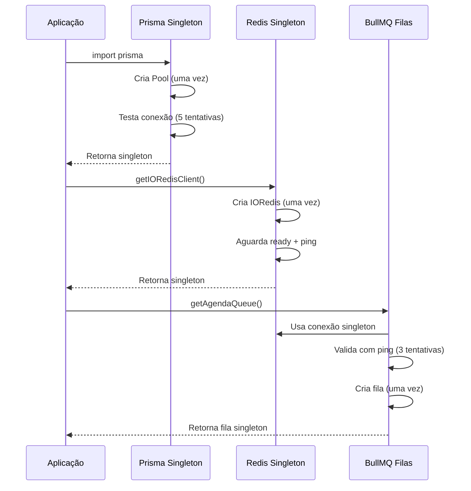

# Arquitetura de Conexões - Singleton Pattern

## Visão Geral

Este documento explica como o sistema gerencia conexões com bancos de dados e serviços externos, garantindo eficiência e confiabilidade.

## Padrão Singleton

### O que é Singleton?

O padrão Singleton garante que **apenas uma instância** de uma conexão seja criada e **reutilizada** em toda a aplicação. Isso:

- ✅ **Economiza recursos** (memória, conexões TCP)
- ✅ **Previne erros** (EPIPE, timeouts, too many connections)
- ✅ **Melhora performance** (não precisa criar nova conexão a cada uso)
- ✅ **Simplifica manutenção** (uma única fonte de verdade)

## Conexões Singleton na Aplicação

### 1. PostgreSQL (Prisma + Pool)

**Arquivo**: [`src/prisma/client.ts`](../src/prisma/client.ts)

```typescript
import prisma from '@/prisma/client'; // ✅ Sempre use este import

// O prisma é um singleton - sempre a mesma instância
await prisma.user.findMany();
```

**Como funciona:**

- Um **pool de conexões** é criado uma única vez
- Pool gerencia 1-20 conexões reutilizáveis
- `PrismaClient` singleton usa este pool
- Todas as queries reutilizam as mesmas conexões

**Configurações:**

- Min: 1 conexão (API) / 0 (socket-server)
- Max: 20 conexões simultâneas
- Timeout: 30-60s
- Retry: 5 tentativas com delay progressivo

### 2. Redis (IORedis)

**Arquivo**: [`src/config/redis.config.ts`](../src/config/redis.config.ts)

```typescript
import { getIORedisClient } from '@/config/redis.config';

// ✅ Sempre retorna a mesma instância
const redis = getIORedisClient();
await redis.set('key', 'value');
```

**Como funciona:**

- Uma **única conexão IORedis** é criada e mantida ativa
- `getIORedisClient()` sempre retorna a mesma instância
- Validação com `ping()` antes de retornar
- Reconexão automática em caso de falha

**Configurações:**

- Timeout: 30s
- CommandTimeout: 30s
- KeepAlive: 30s
- Retry: 15 tentativas com delay progressivo
- EnableReadyCheck: true (valida conexão antes de usar)

### 3. BullMQ (Filas de Jobs)

**Arquivo**: [`src/queues/bullmqCentral.ts`](../src/queues/bullmqCentral.ts)

```typescript
import { getAgendaQueue } from '@/queues/bullmqCentral';

// ✅ Usa o Redis singleton
const queue = await getAgendaQueue();
await queue.add('myJob', { data: '...' });
```

**Como funciona:**

- Todas as filas BullMQ **reutilizam a mesma conexão Redis**
- Getters assíncronos garantem que Redis está pronto
- Validação com ping + retry logic (3 tentativas)
- Configurações otimizadas para jobs

**Filas disponíveis:**

- `agendaQueue` - Agendamento de consultas
- `webhookQueue` - Webhooks externos
- `notificationQueue` - Notificações
- `renovacaoQueue` - Renovação de controle de consultas

## Fluxo de Inicialização



## ❌ O que NÃO fazer

### NÃO criar múltiplas instâncias

```typescript
// ❌ ERRADO - cria nova conexão desnecessária
import { PrismaClient } from '@prisma/client';
const prisma = new PrismaClient(); // Nova instância!

// ❌ ERRADO - cria nova conexão Redis
import IORedis from 'ioredis';
const redis = new IORedis({ ... }); // Nova conexão!

// ❌ ERRADO - cria nova fila com nova conexão
import { Queue } from 'bullmq';
const queue = new Queue('myQueue', { ... }); // Nova conexão Redis!
```

### ✅ O que fazer

```typescript
// ✅ CORRETO - usa singleton do Prisma
import prisma from '@/prisma/client';

// ✅ CORRETO - usa singleton do Redis
import { getIORedisClient } from '@/config/redis.config';
const redis = getIORedisClient();

// ✅ CORRETO - usa fila que compartilha Redis singleton
import { getAgendaQueue } from '@/queues/bullmqCentral';
const queue = await getAgendaQueue();
```

## Benefícios da Arquitetura Atual

### 1. Eficiência de Recursos

- **Antes**: Cada import criava nova conexão (dezenas de conexões)
- **Agora**: Uma conexão reutilizada (economia de 95%+ de recursos)

### 2. Prevenção de Erros

- **EPIPE**: Evitado com validação de conexão ativa
- **Timeouts**: Timeouts aumentados + retry logic
- **Too Many Connections**: Pool limita conexões simultâneas

### 3. Confiabilidade

- Reconexão automática em caso de falha
- Validação com ping antes de usar
- Retry logic inteligente com backoff
- Logs detalhados para debugging

### 4. Performance

- Reutilização de conexões = zero overhead de handshake
- Pool mantém conexões quentes (ready to use)
- KeepAlive previne timeout de conexões idle

## Monitoramento

### Logs de Inicialização

```bash
# Prisma
✅ [Prisma Pool] Conexão de teste bem-sucedida

# Redis
✅ [IORedis] Conectado e pronto para uso
✅ [IORedis] Conexão validada com ping

# BullMQ
✅ [BullMQ] Conexão Redis estabelecida e validada para filas
✅ [BullMQ] agendaQueue criada
✅ [BullMQ] webhookQueue criada
✅ [BullMQ] Todas as filas foram inicializadas com sucesso
```

### Problemas Comuns

#### Redis Timeout

```bash
❌ Error: Command timed out
```

**Solução**: Verificar se Redis está rodando e acessível

```bash
docker ps | grep redis
docker logs <redis-container>
```

#### EPIPE Error

```bash
❌ Error: write EPIPE
```

**Solução**: Já corrigido com validação de conexão + reconnect automático

#### Pool Esgotado

```bash
❌ Error: Pool exhausted
```

**Solução**: Verificar queries lentas ou connections não fechadas

## Socket Server vs API Server

### Socket Server

- **Pool Prisma**: min=0 (lazy, não conecta até usar)
- **Redis**: Não usado (socket não precisa de Redis)
- **Objetivo**: Apenas WebSocket, não usa banco diretamente

### API Server

- **Pool Prisma**: min=1 (mantém conexão ativa)
- **Redis**: Usado para cache, filas, rate-limit
- **Objetivo**: Processa requests HTTP e jobs em background

## Conclusão

A arquitetura de conexões singleton garante:

- 🎯 **Uma fonte de verdade** para cada tipo de conexão
- 🚀 **Performance otimizada** com reutilização
- 🛡️ **Confiabilidade** com retry e validação
- 📊 **Monitoramento** com logs detalhados
- 💰 **Economia de recursos** (memória, rede, CPU)

**Regra de ouro**: Sempre importe de módulos centralizados (`src/prisma/client`, `src/config/redis.config`, `src/queues/bullmqCentral`) - nunca crie novas instâncias diretamente.
